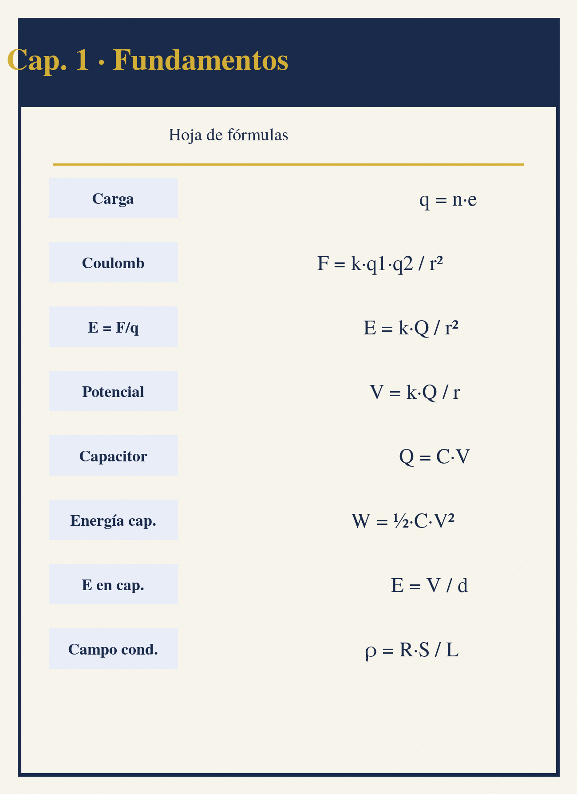

```{=latex}
\clearpage
\thispagestyle{empty}
\begin{tikzpicture}[remember picture, overlay]
  \node[inner sep=0pt] at (current page.center) {\includegraphics[width=\paperwidth,height=\paperheight]{img/portadilla-01.png}};
\end{tikzpicture}
\clearpage
```

# Fundamentos de Electrotecnia


## Carga Eléctrica y Ley de Coulomb

La carga eléctrica es una propiedad intrínseca de la materia que determina su interacción electromagnética. Existen dos tipos de carga: positiva (protones) y negativa (electrones). La carga se cuantiza en múltiplos enteros de la carga elemental $e = 1.602 \times 10^{-19}$ C. La conservación de la carga establece que la carga total en un sistema aislado permanece constante [@boylestad2023, cap. 1].

### Ley de Coulomb

La fuerza electrostática entre dos cargas puntuales en el vacío está dada por la ley de Coulomb:

$$F = k \frac{|q_1 q_2|}{r^2}$$

donde $k = 1/(4\pi\varepsilon_0)$ es la constante de Coulomb, $\varepsilon_0 = 8.854 \times 10^{-12}$ F/m es la permitividad del vacío, $q_1$ y $q_2$ son las magnitudes de las cargas, y $r$ es la distancia entre ellas. La fuerza es atractiva para cargas de signo opuesto y repulsiva para cargas del mismo signo.

| **Variable** | **Significado** | **Unidad** |
| :------------: | :---------------: | :----------: |
| $F$ | Fuerza electrostática | N |
| $k$ | Constante de Coulomb | $8.99 \times 10^9$ N·m²/C² |
| $\varepsilon_0$ | Permitividad del vacío | $8.854 \times 10^{-12}$ F/m |
| $q_1, q_2$ | Magnitud de cada carga | C |
| $r$ | Distancia entre centros | m |

```python
# Ejemplo: Fuerza entre +3 uC y -5 uC a 0.2 m
k = 8.99e9
q1 = 3e-6
q2 = -5e-6
r = 0.2
F = k * abs(q1) * abs(q2) / r**2
print(f"F = {F:.2f} N")  # F = 3.37 N (atraccion)
```

> **Nota:** En medios dieléctricos, la fuerza se reduce por el factor de la permitividad relativa $\varepsilon_r$: $F = \frac{1}{4\pi\varepsilon_0\varepsilon_r} \frac{|q_1 q_2|}{r^2}$.

Los prefijos del Sistema Internacional de uso más frecuente en electrotecnia son [@iec60364, sec. 411]:

| **Prefijo** | **Símbolo** | **Factor** | **Ejemplo típico** |
| :---------: | :---------: | :--------: | :----------------: |
| Giga | G | $10^9$ | GHz (frecuencias) |
| Mega | M | $10^6$ | MΩ, MVA |
| Kilo | k | $10^3$ | kV, kW, kVA |
| — | — | $10^0$ | V, A, W |
| Mili | m | $10^{-3}$ | mA, mV |
| Micro | $\mu$ | $10^{-6}$ | $\mu$A, $\mu$F |
| Nano | n | $10^{-9}$ | nF (temporizadores) |
| Pico | p | $10^{-12}$ | pF (parásitas)

### Principio de Superposición

Para un sistema de $n$ cargas, la fuerza neta sobre una carga $q_0$ es la suma vectorial de las fuerzas individuales:

$$\vec{F}_0 = \sum_{i=1}^{n} k \frac{q_0 q_i}{r_{0i}^2} \hat{r}_{0i}$$

```python
import math
# Superposicion: fuerza neta sobre q0 = 2 uC en el origen
# q1 = 3 uC en (0.1, 0), q2 = -4 uC en (0, 0.15)
import math
k = 8.99e9
q0 = 2e-6
charges = [(3e-6, 0.1, 0), (-4e-6, 0, 0.15)]
Fx, Fy = 0.0, 0.0
for qi, xi, yi in charges:
    r = math.hypot(xi, yi)
    F_mag = k * abs(q0 * qi) / r**2
    Fx += F_mag * xi / r * (1 if q0*qi > 0 else -1)
    Fy += F_mag * yi / r * (1 if q0*qi > 0 else -1)
F_net = math.hypot(Fx, Fy)
print(f"Fuerza neta: {F_net:.4f} N, "
      f"angulo: {math.degrees(math.atan2(Fy, Fx)):.1f} deg")
```

---

## Campo Eléctrico

El campo eléctrico $\vec{E}$ en un punto del espacio se define como la fuerza por unidad de carga que experimentaría una carga de prueba positiva infinitesimal colocada en ese punto:

$$\vec{E} = \frac{\vec{F}}{q_0} \qquad [\vec{E}] = \text{N/C} = \text{V/m}$$

Para una carga puntual $q$:

$$\vec{E} = k \frac{q}{r^2} \hat{r}$$

Las líneas de campo eléctrico son una representación gráfica: salen de cargas positivas y entran en cargas negativas; su densidad es proporcional a la magnitud del campo [@alexander2021, cap. 1].

La permitividad relativa de un material indica cuánto se debilita el campo (y la fuerza entre cargas) respecto al vacío:

| **Material** | $\varepsilon_r$ | **Aplicación típica** |
| :----------: | :-------------: | :-------------------: |
| Vacío | 1 | Referencia |
| Aire | 1.0006 | Líneas aéreas, aislamiento |
| Papel | 3–4 | Condensadores de papel |
| Mica | 5–7 | Condensadores de precisión |
| Cerámica | 6–1000 | Condensadores cerámicos |
| Vidrio | 5–10 | Aislamiento de alta tensión |
| Agua | 80 | Capacidades locales (efecto sobre líneas) |

### Campo de Distribuciones Continuas

Para distribuciones continuas de carga, el campo total se obtiene integrando las contribuciones de cada elemento de carga $dq$:

$$\vec{E} = \int k \frac{dq}{r^2} \hat{r}$$

**Ejemplos comunes:**

| **Distribucion** | **Campo electrico** | **Direccion** |
| :--------------: | :-----------------: | :-----------: |
| Linea infinita ($\lambda$) | $E = \frac{\lambda}{2\pi\varepsilon_0 r}$ | Radial |
| Plano infinito ($\sigma$) | $E = \frac{\sigma}{2\varepsilon_0}$ | Perpendicular |
| Esfera cargada ($Q$, $r > R$) | $E = \frac{Q}{4\pi\varepsilon_0 r^2}$ | Radial |
| Esfera cargada ($Q$, $r < R$) | $E = \frac{Q r}{4\pi\varepsilon_0 R^3}$ | Radial |

```python
import math
# Campo electrico de un dipolo: +q en (0, d/2), -q en (0, -d/2)
# Punto P en eje x a distancia x del origen
k = 8.99e9
q = 1e-6
d = 0.02
x = 0.1
r1 = math.hypot(x, d/2)
r2 = math.hypot(x, -d/2)
# Componentes y se cancelan, solo Ex permanece
Ex = k * q * (x/r1**3 - x/r2**3)
print(f"Campo en x={x} m: Ex = {Ex:.2f} N/C")
```

### Flujo Eléctrico y Ley de Gauss

El flujo eléctrico a través de una superficie $S$ es:

$$\Phi_E = \oint_S \vec{E} \cdot d\vec{A}$$

La ley de Gauss establece que el flujo total a través de una superficie cerrada es proporcional a la carga encerrada:

$$\Phi_E = \frac{Q_{enc}}{\varepsilon_0}$$

Esta ley es fundamental para calcular campos en configuraciones con alta simetría (esférica, cilíndrica, planar) [@chapman2012, cap. 2].

---

## Potencial Eléctrico y Voltaje

El potencial eléctrico $V$ en un punto es la energía potencial por unidad de carga:

$$V = \frac{U}{q_0} \qquad [V] = \text{J/C} = \text{V}$$

La diferencia de potencial (voltaje) entre dos puntos $A$ y $B$ es el trabajo por unidad de carga para mover una carga de prueba de $A$ a $B$:

$$V_{AB} = V_B - V_A = -\int_A^B \vec{E} \cdot d\vec{l}$$

Para una carga puntual $q$, tomando $V(\infty) = 0$:

$$V = k \frac{q}{r}$$

### Potencial de Múltiples Cargas

Por superposición, el potencial total es la suma algebraica (no vectorial) de los potenciales individuales:

$$V_{total} = \sum_{i=1}^{n} k \frac{q_i}{r_i}$$

```python
import math
# Potencial en el origen debido a tres cargas
k = 8.99e9
charges = [(2e-6, 0.1, 0), (-3e-6, 0, 0.15), (1e-6, -0.1, -0.1)]
V_total = sum(k * q / math.hypot(x, y) for q, x, y in charges)
print(f"Potencial total: {V_total:.2f} V")
```

### Relación Campo-Potencial

El campo eléctrico es el gradiente negativo del potencial:

$$\vec{E} = -\nabla V = -\left( \frac{\partial V}{\partial x}\hat{i} + \frac{\partial V}{\partial y}\hat{j} + \frac{\partial V}{\partial z}\hat{k} \right)$$

En una dimensión: $E_x = -\frac{dV}{dx}$. Las líneas de campo son perpendiculares a las superficies equipotenciales y apuntan en la dirección de mayor decrecimiento del potencial.

| **Configuracion** | **Potencial V(r)** | **Campo E(r)** |
| :---------------: | :----------------: | :------------: |
| Carga puntual $q$ | $kq/r$ | $kq/r^2$ |
| Dipolo (eje, $r \gg d$) | $k p \cos\theta / r^2$ | $2kp/r^3$ (eje) |
| Esfera conductora $Q$ | $kQ/r$ ($r \ge R$) | $kQ/r^2$ ($r \ge R$) |
| Esfera conductora $Q$ | $kQ/R$ ($r < R$) | $0$ ($r < R$) |

> **Nota:** En el interior de un conductor en equilibrio electrostático, $\vec{E} = 0$ y $V$ = constante.

---

## Energía y Potencia Eléctrica

### Energía Potencial Eléctrica

La energía potencial de un sistema de dos cargas es el trabajo requerido para ensamblarlas:

$$U = k \frac{q_1 q_2}{r}$$

Para un sistema de $n$ cargas:

$$U = \frac{1}{2} \sum_{i=1}^{n} q_i V_i$$

donde $V_i$ es el potencial en la posición de $q_i$ debido a todas las demás cargas. El factor $1/2$ evita el doble conteo.

### Energía en un Capacitor

Un capacitor almacena energía en el campo eléctrico entre sus placas:

$$U = \frac{1}{2} C V^2 = \frac{1}{2} \frac{Q^2}{C} = \frac{1}{2} Q V$$

La densidad de energía en el campo eléctrico es:

$$u_E = \frac{1}{2} \varepsilon_0 \varepsilon_r E^2 \qquad [u_E] = \text{J/m}^3$$

```python
# Energia almacenada en un capacitor
C = 100e-6  # 100 uF
V = 12.0    # 12 V
U = 0.5 * C * V**2
Q = C * V
print(f"Energia: {U:.4f} J")
print(f"Carga: {Q:.4f} C")
print(f"Densidad de energia (E = V/d, d=1mm): "
      f"{0.5 * 8.854e-12 * (V/0.001)**2:.2e} J/m^3")
```

### Potencia Eléctrica

La potencia eléctrica instantánea es la tasa de transferencia de energía:

$$P = \frac{dU}{dt} = V I$$

En circuitos DC con elementos resistivos, la potencia disipada (efecto Joule) es:

$$P = V I = I^2 R = \frac{V^2}{R}$$

La energía consumida en un intervalo de tiempo:

$$W = \int P \, dt = \int V I \, dt$$

En unidades prácticas: 1 kWh = 3.6 MJ.

| **Formula** | **Aplicable cuando** |
| :---------: | :------------------: |
| $P = VI$ | General (cualquier elemento) |
| $P = I^2 R$ | Resistencia conocida, corriente conocida |
| $P = V^2/R$ | Resistencia conocida, voltaje conocido |

```python
# Potencia en un resistor
R = 10.0    # ohm
V = 12.0    # V
I = V / R
P_VI = V * I
P_I2R = I**2 * R
P_V2R = V**2 / R
print(f"I = {I:.2f} A")
print(f"P = VI = {P_VI:.2f} W")
print(f"P = I^2R = {P_I2R:.2f} W")
print(f"P = V^2/R = {P_V2R:.2f} W")
```

---

## Resistividad y Resistencia

La resistencia $R$ de un conductor depende de su geometría y del material:

$$R = \rho \frac{L}{A} \qquad [R] = \Omega$$

donde $\rho$ es la resistividad (propiedad del material), $L$ es la longitud y $A$ es el área de sección transversal. La conductividad es $\sigma = 1/\rho$.

### Resistividad de Materiales Comunes (a 20°C)

| **Material** | **$\rho$ ($\Omega \cdot$m)** | **Uso tipico** |
| :----------: | :---------------------------: | :------------: |
| Plata | $1.59 \times 10^{-8}$ | Contactos especiales |
| Cobre | $1.68 \times 10^{-8}$ | Cableado electrico |
| Oro | $2.44 \times 10^{-8}$ | Conectores |
| Aluminio | $2.82 \times 10^{-8}$ | Lineas aereas |
| Tungsteno | $5.60 \times 10^{-8}$ | Filamentos |
| Acero (carbono) | $1.0 \times 10^{-7}$ | Estructuras |
| Niquel | $6.99 \times 10^{-8}$ | Resistencias |
| Constantan | $4.9 \times 10^{-7}$ | Resistencias de precision |
| Mercurio | $9.8 \times 10^{-7}$ | Interruptores |
| Carbon (grafito) | $3.5 \times 10^{-5}$ | Cepillos, electrodos |

### Dependencia con la Temperatura

Para la mayoría de metales, la resistividad varía linealmente con la temperatura en un rango amplio:

$$\rho_T = \rho_0 [1 + \alpha (T - T_0)]$$

$$R_T = R_0 [1 + \alpha (T - T_0)]$$

donde $\alpha$ es el coeficiente de temperatura de la resistividad (typ. $0.0039/^\circ\text{C}$ para cobre).

| **Material** | **$\alpha$ ($/^\circ$C)** |
| :----------: | :-----------------------: |
| Cobre | 0.00393 |
| Aluminio | 0.00429 |
| Tungsteno | 0.0045 |
| Niquel | 0.006 |
| Hierro | 0.0065 |
| Constantan | 0.00001 |

```python
# Resistencia de un cable de cobre a diferente temperatura
rho_20 = 1.68e-8  # ohm*m a 20 degC
alpha = 0.00393   # /degC
L = 100.0         # m
A = 2.5e-6        # m^2 (2.5 mm^2)
R_20 = rho_20 * L / A
T = 70.0          # degC
R_T = R_20 * (1 + alpha * (T - 20))
print(f"R a 20 degC: {R_20:.3f} ohm")
print(f"R a {T} degC: {R_T:.3f} ohm")
print(f"Incremento: {(R_T/R_20 - 1)*100:.1f}%")
```

### Resistores y Código de Colores

Los resistores comerciales usan códigos de colores para indicar valor y tolerancia. Para resistores de 4 bandas:

| **Color** | **Digito** | **Multiplicador** | **Tolerancia** |
| :-------: | :--------: | :---------------: | :------------: |
| Negro | 0 | $10^0$ | — |
| Marron | 1 | $10^1$ | $\pm 1\%$ |
| Rojo | 2 | $10^2$ | $\pm 2\%$ |
| Naranja | 3 | $10^3$ | — |
| Amarillo | 4 | $10^4$ | — |
| Verde | 5 | $10^5$ | $\pm 0.5\%$ |
| Azul | 6 | $10^6$ | $\pm 0.25\%$ |
| Violeta | 7 | $10^7$ | $\pm 0.1\%$ |
| Gris | 8 | $10^8$ | $\pm 0.05\%$ |
| Blanco | 9 | $10^9$ | — |
| Dorado | — | $10^{-1}$ | $\pm 5\%$ |
| Plateado | — | $10^{-2}$ | $\pm 10\%$ |

Ejemplo: Marron-Negro-Rojo-Dorado = $10 \times 10^2 = 1\ \text{k}\Omega \pm 5\%$.

---

## Ley de Ohm y Potencia en DC

### Ley de Ohm

La ley de Ohm establece que la corriente a través de un conductor entre dos puntos es directamente proporcional al voltaje entre esos puntos e inversamente proporcional a la resistencia:

$$V = I R \qquad I = \frac{V}{R} \qquad R = \frac{V}{I}$$

Esta ley se cumple para materiales óhmicos (metales, carbono) en un rango amplio de condiciones. Los dispositivos no óhmicos (diodos, transistores, lámparas incandescentes en caliente) no siguen esta relación lineal [@retie, art. 110.14].

### Potencia en Circuitos DC

La potencia absorbida o entregada por un elemento:

$$P = V I = I^2 R = \frac{V^2}{R}$$

Signos: $P > 0$ indica absorción (disipación en resistores, carga en baterías); $P < 0$ indica entrega (fuentes, baterías descargando).

| **Elemento** | **Relacion V-I** | **Potencia** |
| :----------: | :--------------: | :----------: |
| Resistor | $V = IR$ | $P = I^2R = V^2/R$ (siempre absorbe) |
| Fuente de voltaje ideal | $V = \text{cte}$ | $P = VI$ (entrega o absorbe) |
| Fuente de corriente ideal | $I = \text{cte}$ | $P = VI$ (entrega o absorbe) |
| Cortocircuito | $V = 0$ | $P = 0$ |
| Circuito abierto | $I = 0$ | $P = 0$ |

### Divisor de Voltaje y Divisor de Corriente

**Divisor de voltaje** (resistencias en serie):

$$V_1 = V_{total} \frac{R_1}{R_1 + R_2} \qquad V_2 = V_{total} \frac{R_2}{R_1 + R_2}$$

**Divisor de corriente** (resistencias en paralelo):

$$I_1 = I_{total} \frac{R_2}{R_1 + R_2} \qquad I_2 = I_{total} \frac{R_1}{R_1 + R_2}$$

```python
# Divisor de voltaje
Vin = 12.0
R1 = 1000.0
R2 = 2000.0
Vout = Vin * R2 / (R1 + R2)
print(f"Vout = {Vout:.2f} V")
print(f"Corriente: {Vin/(R1+R2)*1000:.2f} mA")
print(f"Potencia en R1: {(Vin/(R1+R2))**2 * R1:.3f} W")
print(f"Potencia en R2: {(Vin/(R1+R2))**2 * R2:.3f} W")

# Divisor de corriente
Iin = 10e-3
R1 = 1000.0
R2 = 2000.0
I1 = Iin * R2 / (R1 + R2)
I2 = Iin * R1 / (R1 + R2)
print(f"I1 = {I1*1000:.2f} mA, I2 = {I2*1000:.2f} mA")
```

### Resistencias en Serie y Paralelo

**Serie:** $R_{eq} = \sum R_i$, misma corriente, voltajes se suman.

**Paralelo:** $\frac{1}{R_{eq}} = \sum \frac{1}{R_i}$, mismo voltaje, corrientes se suman.

Para dos resistencias en paralelo: $R_{eq} = \frac{R_1 R_2}{R_1 + R_2}$.

| **Configuracion** | **$R_{eq}$** | **Corriente** | **Voltaje** |
| :---------------: | :----------: | :-----------: | :---------: |
| Serie | $\sum R_i$ | Igual en todas | Se reparte |
| Paralelo | $(\sum 1/R_i)^{-1}$ | Se reparte | Igual en todas |

```python
# Resistencia equivalente de red serie-paralelo
# R1=100, R2=200 en serie, en paralelo con R3=300
R1, R2, R3 = 100.0, 200.0, 300.0
R_series = R1 + R2
R_eq = R_series * R3 / (R_series + R3)
print(f"R_serie = {R_series:.1f} ohm")
print(f"R_eq total = {R_eq:.2f} ohm")

# Potencia total con Vin = 12V
Vin = 12.0
P_total = Vin**2 / R_eq
print(f"Potencia total: {P_total:.3f} W")
```

### Leyes de Kirchhoff (Introducción)

Para análisis de circuitos complejos, se usan las leyes de Kirchhoff (ver Capítulo 2):

- **Ley de corrientes (Nodos):** $\sum I_{entrada} = \sum I_{salida}$ (conservación de carga)
- **Ley de voltajes (Mallas):** $\sum V = 0$ (conservación de energía)

---

## Resumen de Fórmulas Clave

| **Concepto** | **Formula** |
| :----------- | :--------- |
| Ley de Coulomb | $F = k \frac{|q_1 q_2|}{r^2}$ |
| Campo electrico (carga puntual) | $E = k \frac{q}{r^2}$ |
| Potencial electrico (carga puntual) | $V = k \frac{q}{r}$ |
| Ley de Gauss | $\Phi_E = Q_{enc}/\varepsilon_0$ |
| Energia capacitor | $U = \frac{1}{2}CV^2$ |
| Densidad energia campo E | $u_E = \frac{1}{2}\varepsilon_0\varepsilon_r E^2$ |
| Resistencia | $R = \rho L/A$ |
| Resistividad vs temperatura | $\rho_T = \rho_0[1+\alpha(T-T_0)]$ |
| Ley de Ohm | $V = IR$ |
| Potencia DC | $P = VI = I^2R = V^2/R$ |
| Divisor de voltaje | $V_1 = V \frac{R_1}{R_1+R_2}$ |
| Divisor de corriente | $I_1 = I \frac{R_2}{R_1+R_2}$ |
| Serie | $R_{eq} = \sum R_i$ |
| Paralelo | $1/R_{eq} = \sum 1/R_i$ |

---

## Referencias

Boylestad, R. L. *Introductory Circuit Analysis*. 14th ed. Pearson, 2023.

Alexander, C. K. and Sadiku, M. N. O. *Fundamentals of Electric Circuits*. 7th ed. McGraw-Hill, 2021.

Chapman, S. J. *Electric Machinery Fundamentals*. 5th ed. McGraw-Hill, 2012.

IEC 60364. *Low-voltage electrical installations*. International Electrotechnical Commission.

RETIE. *Reglamento Técnico de Instalaciones Eléctricas*. Colombia.

## Hoja de fórmulas

{width=100%}
