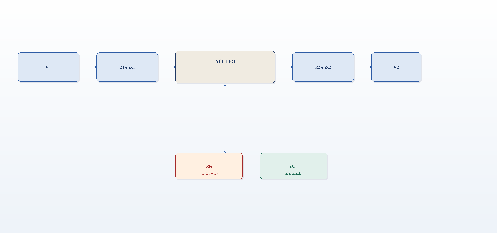
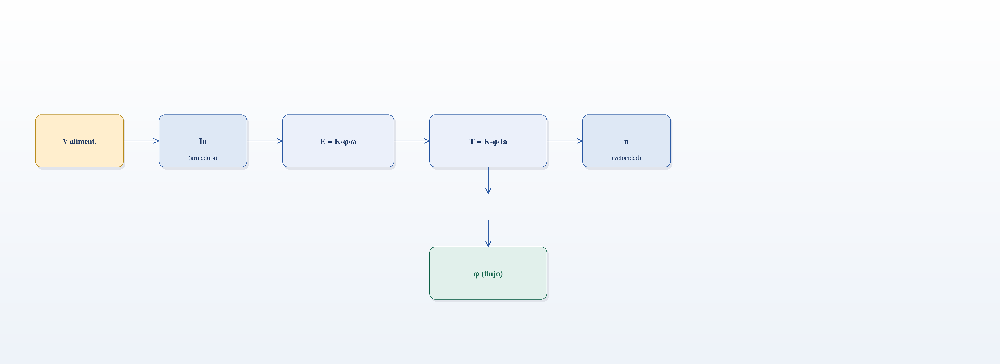
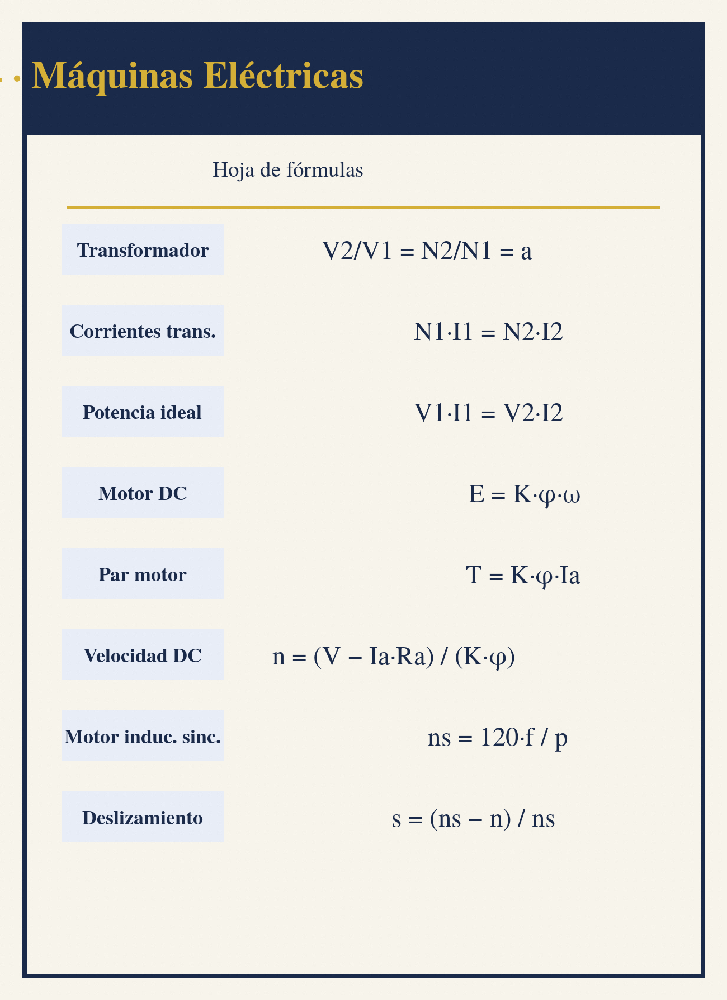

```{=latex}
\clearpage
\thispagestyle{empty}
\begin{tikzpicture}[remember picture, overlay]
  \node[inner sep=0pt] at (current page.center) {\includegraphics[width=\paperwidth,height=\paperheight]{img/portadilla-04.png}};
\end{tikzpicture}
\clearpage
```

# Máquinas Eléctricas


Las máquinas eléctricas son dispositivos que convierten energía entre los dominios eléctrico y mecánico. En sentido generador, convierten energía mecánica en eléctrica; en sentido motor, energía eléctrica en mecánica. Los principios físicos que las gobiernan son el electromagnetismo (Capítulo 1), la inducción de Faraday y la fuerza de Lorentz, y su comportamiento en régimen de corriente alterna se apoya en los fasores e impedancias del Capítulo 3 [@chapman2012, cap. 1].

Este capítulo estudia los transformadores, las máquinas de corriente continua, las máquinas síncronas de corriente alterna, las máquinas de inducción y los motores especiales. El enfoque es el del ingeniero de aplicación: comprender los circuitos equivalentes, las características de par-velocidad y los criterios de selección y operación [@chapman2012, cap. 2].

---

## Principios Electromagnéticos

### Flujo Magnético y Fuerza Magnetomotriz

El flujo magnético $\phi$ (en webers) atraviesa un circuito magnético de sección $A$ con densidad de flujo $B$ (teslas):

$$\phi = \int_S \vec{B} \cdot d\vec{A}$$

Una bobina de $N$ espiras recorrida por una corriente $I$ produce una fuerza magnetomotriz (fmm):

$$\mathcal{F} = N I \qquad [\text{A-vueltas}]$$

La relación entre flujo y fmm depende de la reluctancia $\mathcal{R}$ del circuito magnético (análoga a la resistencia eléctrica):

$$\phi = \frac{\mathcal{F}}{\mathcal{R}} \qquad \mathcal{R} = \frac{l}{\mu A}$$

| **Magnitud** | **Simbolo** | **Unidad** | **Analogia electrica** |
| :----------: | :---------: | :--------: | :--------------------: |
| Fuerza magnetomotriz | $\mathcal{F}$ | A-vueltas | Fem |
| Flujo | $\phi$ | Wb | Corriente |
| Reluctancia | $\mathcal{R}$ | A/Wb | Resistencia |
| Permeabilidad | $\mu$ | H/m | Conductividad |

```python
import math
# Circuito magnetico simple: nucleo de hierro con entrehierro
mu0 = 4 * math.pi * 1e-7        # H/m
mu_r = 1000.0                   # hierro
l_hierro = 0.3                  # m
A = 4e-4                        # m^2 (4 cm^2)
l_aire = 1e-3                   # m (entrehierro 1 mm)
R_fierro = l_hierro / (mu_r * mu0 * A)
R_aire = l_aire / (mu0 * A)
R_total = R_fierro + R_aire
print(f"R_fierro = {R_fierro:.0f} A/Wb")
print(f"R_aire = {R_aire:.0f} A/Wb (domina pese a 1 mm)")
print(f"R_total = {R_total:.0f} A/Wb")
N, I = 500.0, 2.0
phi = N * I / R_total
print(f"phi = {phi*1000:.2f} mWb, B = {phi/A:.2f} T")
```

### Ley de Faraday y Ley de Lenz

La ley de Faraday establece que una fem se induce en un circuito cuando cambia el flujo que lo atraviesa:

$$e = -N \frac{d\phi}{dt}$$

La ley de Lenz determina el sentido de la fem inducida: la corriente inducida crea un flujo que se opone al cambio de flujo que la produce. El signo negativo expresa esta oposición. Este principio genera la fuerza contraelectromotriz en motores y la fem en generadores [@chapman2012, cap. 1].

```python
# Fem inducida en una bobina
N = 100.0
dphi = 0.02          # cambio de flujo (Wb)
dt = 0.1             # s
e = -N * dphi / dt
print(f"e = {e:.1f} V (negativa: se opone al cambio)")
```

### Fuerza sobre un Conductor

Un conductor de longitud $l$ recorrido por corriente $I$ dentro de un campo $B$ perpendicular experimenta una fuerza:

$$F = B I l$$

Si el conductor se mueve con velocidad $v$ perpendicular al campo, se induce una fem:

$$e = B l v$$

```python
# Fuerza sobre conductor en un motor
B = 0.5        # T
I = 10.0       # A
l = 0.25       # m
F = B * I * l
print(f"F = {F:.2f} N")
# Fem inducida al moverse
v = 5.0        # m/s
e = B * l * v
print(f"e = {e:.2f} V")
```

> **Nota:** La interacción entre la fuerza de Lorentz (motor) y la fem de Faraday (generador) explica la reversibilidad de las máquinas eléctricas: el mismo dispositivo físico puede operar como motor o generador según el sentido del flujo de energía.

---

## Transformadores

### Transformador Ideal

Un transformador transfiere energía entre dos circuitos acoplados magnéticamente mediante un núcleo común. Para el transformador ideal, las relaciones entre tensiones y corrientes de primario (1) y secundario (2) son:

$$\frac{V_1}{V_2} = \frac{N_1}{N_2} = a \qquad \frac{I_2}{I_1} = \frac{N_1}{N_2} = a$$

donde $a = N_1/N_2$ es la relación de transformación. La potencia se conserva: $V_1 I_1 = V_2 I_2$.

```python
N1, N2 = 1000.0, 100.0
a = N1 / N2
V1 = 230.0
V2 = V1 / a
I2 = 10.0
I1 = I2 / a
print(f"a = {a:.0f}")
print(f"V2 = {V2:.1f} V, I1 = {I1:.2f} A")
P = V1 * I1
print(f"P = {P:.0f} W en ambos lados (ideal)")
```

### Impedancias Reflejadas

Una impedancia $Z_2$ conectada al secundario se ve desde el primario como:

$$Z_1' = a^2 Z_2$$

Esta propiedad permite el ajuste de impedancias (máxima transferencia de potencia, sección 4 del Capítulo 2).

```python
import math
# Reflexion de impedancia
Z2 = 8.0        # ohm (altavoz)
a_opt = math.sqrt(4800.0 / Z2)    # para fuente de 4.8 kohm
print(f"a optimo = {a_opt:.1f}:1")
print(f"Z1' = {a_opt**2 * Z2:.0f} ohm (fuente vista)")
```

### Transformador Real: Pérdidas y Circuito Equivalente

El transformador real presenta pérdidas en el cobre (devanados) y en el hierro (núcleo):

| **Perdida** | **Causa** | **Proporcional a** | **Ensayada en** |
| :---------: | :-------: | :----------------: | :-------------: |
| Cobre ($P_{cu}$) | Resistencia de devanados | $I^2 R$ | Cortocircuito |
| Hierro ($P_{fe}$) | Histéresis y corrientes parásitas | $V^2$ aprox. | Vacío |

El circuito equivalente incluye resistencias y reactancias de dispersión en ambos devanados, más la rama de magnetización ($R_c$ y $X_m$) en paralelo. Los ensayos de vacío y de cortocircuito permiten determinar estos parámetros [@chapman2012, cap. 2].

{width=70%}

*Circuito equivalente del transformador*

Los parámetros $R_1 + jX_1$ y $R_2 + jX_2$ se obtienen del ensayo de cortocircuito; $R_{fe}$ y $jX_m$ del ensayo de vacío.

```python
import math
# Ensayo de cortocircuito: parametros referidos al primario
V_cc, I_cc = 20.0, 12.0      # V e I de ensayo
P_cc = 120.0                 # W
Z_eq = V_cc / I_cc
R_eq = P_cc / I_cc**2
X_eq = math.sqrt(Z_eq**2 - R_eq**2)
print(f"Z_eq = {Z_eq:.3f} ohm, R_eq = {R_eq:.3f} ohm, X_eq = {X_eq:.3f} ohm")

# Ensayo de vacio
V_0, I_0 = 230.0, 0.6
P_0 = 50.0
R_c = V_0**2 / P_0
S_0 = V_0 * I_0
Q_0 = math.sqrt(S_0**2 - P_0**2)
X_m = V_0**2 / Q_0
print(f"R_c = {R_c:.0f} ohm, X_m = {X_m:.0f} ohm")
```

### Rendimiento y Regulación

El rendimiento del transformador se define como la relación entre potencia útil y absorbida:

$$\eta = \frac{P_{util}}{P_{util} + P_{cu} + P_{fe}}$$

Los rendimientos típicos varían con el tamaño de la máquina: los transformadores grandes alcanzan eficiencias superiores al 98 %, mientras que los pequeños quedan en torno al 95 % [@chapman2012, cap. 2]:

| **Potencia nominal** | **Rendimiento típico a plena carga** | **Rendimiento a 50 % de carga** |
| :------------------: | :----------------------------------: | :-----------------------------: |
| 5 kVA | 95–96 % | 94–95 % |
| 50 kVA | 96–97 % | 95–96 % |
| 500 kVA | 97–98 % | 96–97 % |
| 2 MVA | 98–99 % | 97–98 % |
| 20 MVA | 99–99.5 % | 98–99 % |

> **Nota:** el rendimiento máximo se obtiene cuando las pérdidas en el cobre igualan las pérdidas en el hierro, típicamente entre el 50 % y el 75 % de la carga nominal.

La regulación de tensión indica la variación de la tensión secundaria entre vacío y plena carga:

$$reg = \frac{V_{2,vac} - V_{2,carga}}{V_{2,carga}} \times 100$$

La temperatura máxima de funcionamiento está limitada por el sistema de aislamiento del bobinado. Cada clase admite una temperatura límite de trabajo continuo [@chapman2012, cap. 2]:

| **Clase de aislamiento** | **Temperatura límite (°C)** | **Material típico** | **Uso común** |
| :----------------------: | :--------------------------: | :-----------------: | :------------: |
| Y | 90 | Algodón, seda, papel | Muy antiguos, secos |
| A | 105 | Algodón impregnado | Motores pequeños |
| E | 120 | Resinas epoxi, poliéster | Motores industriales |
| B | 130 | Mica, fibra de vidrio | Motores estándar |
| F | 155 | Mica con epoxi clase F | Motores reforzados |
| H | 180 | Siliconas, mica clase H | Tracción, hornos |

> **Nota:** La vida útil del aislamiento se reduce a la mitad por cada aumento de unos ~10 °C por encima de la temperatura límite (regla empírica de Arrhenius).

```python
S_n = 100e3        # 100 kVA
FP = 0.9
P_carga = S_n * FP
P_fe, P_cu = 500.0, 1200.0
eta = P_carga / (P_carga + P_fe + P_cu)
print(f"eta = {eta*100:.2f}%")
V2_vac, V2_c = 400.0, 394.0
reg = (V2_vac - V2_c) / V2_c * 100
print(f"Regulacion = {reg:.2f}%")
```

### Autotransformador

El autotransformador usa un único devanado con derivación: parte del devanado es común a primario y secundario. Comparado con un transformador convencional de igual potencia, es más económico y compacto, pero no aísla galvánicamente.

$$V_1 I_1 = V_2 I_2 \qquad \frac{V_1}{V_2} = \frac{N_1}{N_2}$$

| **Aspecto** | **Transformador de aislamiento** | **Autotransformador** |
| :---------: | :-----------------------------: | :-------------------: |
| Devanados | Dos, aislados | Uno, con derivacion |
| Aislamiento galvanico | Si | No |
| Costo para igual potencia | Mayor | Menor |
| Uso tipico | Distribucion, seguridad | Arranque de motores, regulacion |

---

## Máquinas de Corriente Continua

### Construcción y Principio de Funcionamiento

La máquina de CC consta de un estator con polos de excitación (devanado de campo) y un rotor (inducido) con devanados conectados al exterior mediante escobillas y conmutador. El conmutador convierte la corriente alterna inducida en el rotor en corriente directa en los terminales (generador), o invierte la corriente del rotor para mantener el par (motor).

### Generador de CC: Fem Inducida

La fem inducida en el inducido es proporcional al flujo por polo y a la velocidad:

$$E = K \phi \omega$$

donde $K$ es una constante de construcción, $\phi$ el flujo por polo y $\omega$ la velocidad angular.

```python
import math
K = 73.2         # constante constructiva
phi = 0.02       # Wb por polo (K*phi = 1.464 V*s/rad)
n = 1500.0       # rpm
omega = 2 * math.pi * n / 60
E = K * phi * omega
print(f"omega = {omega:.1f} rad/s")
print(f"E = {E:.1f} V a {n:.0f} rpm")
```

### Motor de CC: Par y Velocidad

El par desarrollado es proporcional al flujo y a la corriente de armadura:

$$T = K \phi I_a$$

La velocidad del motor se regula variando el voltaje de armadura o el flujo de campo:

$$\omega = \frac{V - I_a R_a}{K \phi}$$

{width=70%}

*Modelo del motor de corriente continua*

El diagrama muestra la cadena de conversión del motor: el voltaje de armadura fija $E$, el flujo de campo y $E$ determinan la velocidad, y el par ($T = K\phi I_a$) depende del flujo y de la corriente de armadura.

```python
import math
K = 73.2
phi = 0.02
Ia = 25.0
T = K * phi * Ia
print(f"T = {T:.1f} N*m")
V, Ra = 230.0, 0.5
E = V - Ia * Ra
omega = E / (K * phi)
n = omega * 60 / (2 * math.pi)
print(f"E = {E:.1f} V, omega = {omega:.1f} rad/s, n = {n:.0f} rpm")
```

### Tipos de Excitación

| **Tipo** | **Conexion del campo** | **Caracteristica** | **Aplicacion** |
| :------: | :--------------------: | :----------------: | :------------: |
| Derivacion (shunt) | En paralelo con inducido | Velocidad casi constante | Maquinas herramientas |
| Serie | En serie con inducido | Gran par de arranque | Traccion, grúas |
| Compuesta (compound) | Mixta (serie + derivacion) | Combinacion | Laminadores, elevadores |
| Imán permanente | Imán fijo | Compacta y simple | Motores pequenos |

### Reacción de Inducido

La corriente del inducido crea un flujo que distorsiona el campo principal: la reacción de inducido desplaza el plano neutro, reduce el flujo efectivo y puede causar chisporroteo en el conmutador. Se compensa con devanados de conmutación y polos auxiliares [@chapman2012, cap. 7].

```python
import math
# Efecto de la reaccion de inducido sobre la velocidad
K, phi_nominal = 73.2, 0.02
desmagnetizacion = 0.1          # 10% de reduccion de flujo
phi_efectivo = phi_nominal * (1 - desmagnetizacion)
V, Ra, Ia = 230.0, 0.5, 25.0
E = V - Ia * Ra
n_nominal = E / (K * phi_nominal) * 60 / (2 * math.pi)
n_efectivo = E / (K * phi_efectivo) * 60 / (2 * math.pi)
print(f"n nominal = {n_nominal:.0f} rpm")
print(f"n con reaccion = {n_efectivo:.0f} rpm "
      f"(+{100*(n_efectivo/n_nominal-1):.1f}%)")
```

> **Nota:** El motor de CC en derivación es el caballo de batalla de la velocidad regulable. Con control de voltaje de armadura (variadores DC) ofrece par constante hasta velocidad base, y con debilitamiento de campo, potencia aproximadamente constante por encima de la velocidad base.

---

## Máquinas Síncronas de Corriente Alterna

### Principio y Velocidad Síncrona

En la máquina síncrona, el rotor (campo DC) gira a la misma velocidad que el campo giratorio del estator. La frecuencia generada y la velocidad están ligadas por el número de polos $p$:

$$f = \frac{p \cdot n}{120} \qquad n_s = \frac{120 f}{p}$$

```python
p = 4        # polos
f = 50.0     # Hz
n_s = 120 * f / p
print(f"n_s = {n_s:.0f} rpm para p = {p} y f = {f} Hz")
```

| **Polos $p$** | **$n_s$ a 50 Hz (rpm)** | **$n_s$ a 60 Hz (rpm)** |
| :-----------: | :---------------------: | :---------------------: |
| 2 | 3000 | 3600 |
| 4 | 1500 | 1800 |
| 6 | 1000 | 1200 |
| 8 | 750 | 900 |

### Generador Síncrono (Alternador)

El alternador produce la práctica totalidad de la energía eléctrica mundial. Su tensión inducida depende del flujo del rotor (corriente de excitación $I_f$) y de la velocidad. En régimen de carga, la caída de tensión se modela con la reactancia síncrona $X_s$:

$$\vec{V}_\phi = \vec{E}_a - j X_s \vec{I}_a$$

```python
import math
E_a = 240.0      # V por fase
I_a = 100.0      # A
X_s = 0.6        # ohm (reactancia sincrona)
V_phi = math.sqrt(E_a**2 - (I_a * X_s)**2)   # caso FP unitario
print(f"V_phi = {V_phi:.1f} V (FP = 1)")
# En retraso: mayor caida. Formula exacta con sin(phi)
phi = math.acos(0.8)
V_phi_rez = math.sqrt(E_a**2 - 2*E_a*I_a*X_s*math.sin(phi) + (I_a*X_s)**2)
print(f"V_phi = {V_phi_rez:.1f} V (FP = 0.8 en retraso)")
V_phi_aprox = E_a - I_a*X_s*math.sin(phi)
print(f"Aproximacion lineal: {V_phi_aprox:.1f} V")
```

### Motor Síncrono y Curva V

El motor síncrono gira a velocidad constante independiente de la carga (hasta el límite de estabilidad). Su característica más valiosa es la capacidad de controlar el factor de potencia: subexcitado consume reactiva (FP en retraso), sobreexcitado entrega reactiva (FP en adelanto), pudiendo compensar instalaciones [@chapman2012, cap. 5].

La curva V muestra la corriente de armadura mínima a FP unitario; a ambos lados la corriente aumenta:

| **Excitacion** | **Factor de potencia** | **Comportamiento reactivo** |
| :------------: | :--------------------: | :-------------------------: |
| Subexcitado | En retraso | Consume reactiva |
| Normal (FP = 1) | Unitario | No intercambia reactiva |
| Sobreexcitado | En adelanto | Entrega reactiva (compensador síncrono) |

```python
import math
# Potencia de un compensador sincrono
V = 230.0        # V fase
I = 50.0         # A
S = 3 * V * I    # trifasica aparente
Q = math.sqrt(S**2 - (0.0)**2)   # FP = 0 (solo reactiva)
print(f"Compensador: S = {S/1000:.1f} kVA, Q = {Q/1000:.1f} kVAR")
```

---

## Máquinas de Inducción (Asíncronas)

### Campo Giratorio y Deslizamiento

El motor de inducción es el motor industrial por excelencia. Tres corrientes desfasadas 120° en el estator crean un campo magnético giratorio a la velocidad síncrona. El rotor (jaula de ardilla o bobinado) gira más lento; la diferencia relativa es el deslizamiento:

$$s = \frac{n_s - n_r}{n_s}$$

La velocidad del rotor es:

$$n_r = n_s (1 - s) = \frac{120 f}{p}(1 - s)$$

```python
f, p = 50.0, 4
n_s = 120 * f / p
n_r = 1450.0       # rpm medidos
s = (n_s - n_r) / n_s
print(f"n_s = {n_s:.0f} rpm, n_r = {n_r:.0f} rpm, s = {s*100:.2f}%")
```

| **Estado** | **Deslizamiento** | **Observacion** |
| :--------: | :---------------: | :-------------: |
| Reposo / arranque | $s = 1$ | Gran corriente de arranque |
| Plena carga | $s \approx 2\text{--}5\%$ | Régimen nominal |
| Sincronismo | $s = 0$ | Sin par (solo por arrastre) |
| Freno (hipergiratorio) | $s > 1$ | Frenado por contracorriente |

### Frecuencia del Rotor y Circuito Equivalente

Las corrientes del rotor tienen frecuencia proporcional al deslizamiento: $f_r = s f$. El circuito equivalente por fase refleja el rotor con su resistencia dependiente del deslizamiento $R_2/s$, lo que da el par:

$$T = \frac{3 V_1^2 R_2/s}{\omega_s\left[(R_1 + R_2/s)^2 + (X_1 + X_2)^2\right]}$$

```python
import math
V1, R1 = 230.0, 0.4
R2, X1, X2 = 0.3, 1.0, 1.0
f, p = 50.0, 4
n_s = 120 * f / p
omega_s = 2 * math.pi * n_s / 60
for s_i in [0.02, 0.05, 0.1, 0.25, 0.5, 1.0]:
    T = 3 * V1**2 * R2/s_i / (omega_s * ((R1 + R2/s_i)**2 + (X1 + X2)**2))
    print(f"s = {s_i:4.0%}: T = {T:.1f} N*m")
```

### Curva Par-Velocidad y Arranque

La curva par-velocidad del motor de inducción tiene tres zonas: arranque, par máximo (cuña o breakdown) y zona de operación estable cercana a la velocidad síncrona. El par máximo es independiente de la resistencia del rotor, pero la resistencia del rotor (o el control del estator) desplaza el par máximo hacia el arranque.

| **Metodo de arranque** | **Efecto** | **Uso** |
| :--------------------: | :---------: | :-----: |
| Directo | Plena tension, 5-8 x I_n | Motores pequenos |
| Estrella-delta | Tension reducida a 58% | Motores medianos |
| Autotransformador | Tension y par reducidos | Motores grandes |
| Variador de frecuencia (VFD) | Arranque suave, par controlado | Aplicaciones exigentes |

> **Nota:** El arranque directo de un motor de inducción puede tomar de 5 a 8 veces la corriente nominal, provocando caídas de tensión en la red. Los arrancadores suaves y los variadores de frecuencia (VFD) limitan la corriente y permiten control de velocidad — cada vez más habituales en la industria — ver Capítulo 5.

### Regulación de Velocidad

La velocidad del motor de inducción se regula variando la frecuencia (con VFD), el número de polos (motores de polos conmutables) o el deslizamiento (resistencia rotor en motores de rotor bobinado):

$$n_r = \frac{120 f}{p}(1 - s)$$

```python
# VFD: mantener V/f constante
f_vfd = 25.0     # Hz
V_vfd = 230.0 * f_vfd / 50.0
n_vfd = 120 * f_vfd / 4 * (1 - 0.03)
print(f"V_f = {V_vfd:.0f} V, n = {n_vfd:.0f} rpm a {f_vfd:.0f} Hz")
```

---

## Motores Especiales

### Motor Paso a Paso

El motor paso a paso convierte pulsos digitales en movimientos angulares discretos. Cada pulso produce un paso fijo (p. ej., 1.8°), lo que permite posicionamiento preciso en lazo abierto. Se usa en impresoras, CNC, robótica y automatización.

$$\theta = N_{pulsos} \cdot \theta_{paso}$$

```python
theta_paso = 1.8        # deg por pulso
N_pulsos = 200
theta = N_pulsos * theta_paso
print(f"{N_pulsos} pulsos -> {theta:.0f} deg (1 vuelta completa)")
```

### Motor Brushless (BLDC)

El motor sin escobillas (brushless DC) tiene el rotor de imanes permanentes y conmutación electrónica del estator. Ofrece alta eficiencia, larga vida y buen control; requiere un controlador electrónico que sintetice la conmutación. Se usa en vehículos eléctricos, drones, discos y ventiladores.

### Motor Lineal

El motor lineal "desenrolla" un motor rotativo: produce movimiento rectilíneo directo sin mecanismo de conversión. Se emplea en transporte (maglev), máquinas herramienta de alta velocidad y actuadores.

### Motor Universal

El motor universal es un motor de CC en serie optimizado para AC: funciona con ambas corrientes porque el par es proporcional a $I^2$ y no depende del sentido. Útil en herramientas portátiles y electrodomésticos por su alta velocidad y pequeño tamaño.

| **Motor** | **Alimentacion** | **Control** | **Aplicacion tipica** |
| :-------: | :--------------: | :---------: | :--------------------: |
| Paso a paso | Pulsos digitales | Lazo abierto | CNC, impresoras |
| Brushless | DC conmutada | Electronico | Drones, traccion |
| Lineal | AC frecuencia variable | VFD especial | Transporte, actuadores |
| Universal | AC o DC | Triac / velocidad | Herramientas, aspiradoras |

---

## Resumen de Fórmulas Clave

| **Concepto** | **Formula** |
| :----------- | :--------- |
| Flujo magnetico | $\phi = \mathcal{F}/\mathcal{R}$ |
| Reluctancia | $\mathcal{R} = l/(\mu A)$ |
| Ley de Faraday | $e = -N d\phi/dt$ |
| Fuerza sobre conductor | $F = B I l$ |
| Relacion de transformacion | $V_1/V_2 = N_1/N_2 = a$ |
| Impedancia reflejada | $Z_1' = a^2 Z_2$ |
| Rendimiento | $\eta = P_u/(P_u + P_{cu} + P_{fe})$ |
| Fem generador CC | $E = K \phi \omega$ |
| Par motor CC | $T = K \phi I_a$ |
| Velocidad motor CC | $\omega = (V - I_a R_a)/(K \phi)$ |
| Velocidad sincrona | $n_s = 120 f / p$ |
| Alternador | $\vec{V}_\phi = \vec{E}_a - jX_s \vec{I}_a$ |
| Deslizamiento | $s = (n_s - n_r)/n_s$ |
| Velocidad rotor | $n_r = n_s(1 - s)$ |
| Frecuencia rotor | $f_r = s f$ |
| Par induccion | $T = \frac{3 V_1^2 R_2/s}{\omega_s[(R_1 + R_2/s)^2 + (X_1+X_2)^2]}$ |
| VFD velocidad | $n_r = \frac{120 f}{p}(1-s)$ |
| Paso a paso | $\theta = N_{pulsos} \cdot \theta_{paso}$ |

---

## Referencias

Chapman, S. J. *Electric Machinery Fundamentals*. 5th ed. McGraw-Hill, 2012.

Boylestad, R. L. *Introductory Circuit Analysis*. 14th ed. Pearson, 2023.

Alexander, C. K. and Sadiku, M. N. O. *Fundamentals of Electric Circuits*. 7th ed. McGraw-Hill, 2021.

IEC 60364. *Low-voltage electrical installations*. International Electrotechnical Commission.

RETIE. *Reglamento Técnico de Instalaciones Eléctricas*. Colombia.

## Hoja de fórmulas

{width=100%}
