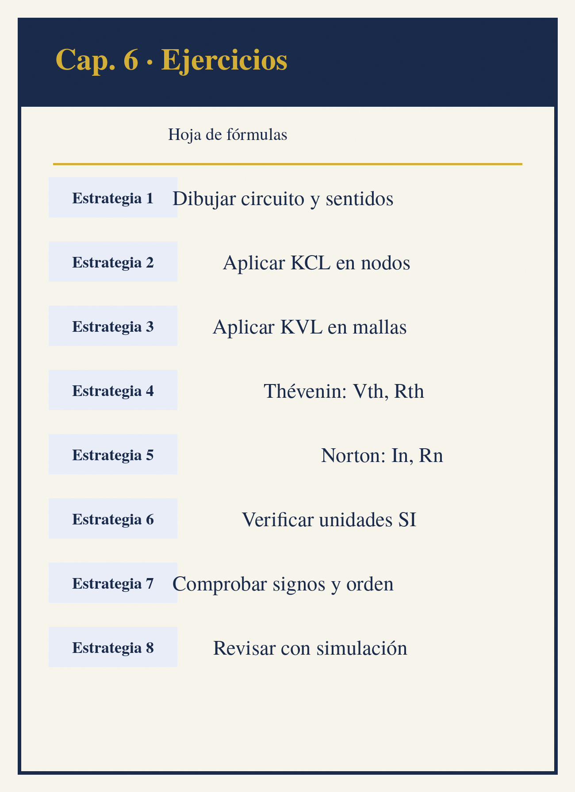

```{=latex}
\clearpage
\thispagestyle{empty}
\begin{tikzpicture}[remember picture, overlay]
  \node[inner sep=0pt] at (current page.center) {\includegraphics[width=\paperwidth,height=\paperheight]{img/portadilla-06.png}};
\end{tikzpicture}
\clearpage
```

# Ejercicios Resueltos y Propuestos


Este capítulo reúne ejercicios que integran los conceptos de los capítulos 1 a 5. Los ejercicios resueltos muestran el procedimiento completo paso a paso, con las referencias al capítulo correspondiente; los ejercicios propuestos permiten practicar de forma autónoma y sus respuestas numéricas se presentan al final del capítulo.

---

## Ejercicios de Fundamentos (Capítulo 1)

### Ejercicio 1.1: Fuerza entre Cargas

**Enunciado:** Dos cargas puntuales de $+4\ \mu\text{C}$ y $-6\ \mu\text{C}$ se encuentran separadas 30 cm en el vacío. Calcule la fuerza electrostática entre ellas e indique si es atractiva o repulsiva.

**Datos:** $q_1 = 4\ \mu\text{C}$, $q_2 = -6\ \mu\text{C}$, $r = 0.3$ m, $k = 8.99 \times 10^9$ N·m²/C².

**Solución:**

Aplicando la ley de Coulomb (Capítulo 1):

$$F = k \frac{|q_1 q_2|}{r^2} = 8.99 \times 10^9 \cdot \frac{4 \times 10^{-6} \cdot 6 \times 10^{-6}}{0.3^2}$$

$$F = 8.99 \times 10^9 \cdot \frac{24 \times 10^{-12}}{0.09} = 8.99 \times 10^9 \cdot 2.667 \times 10^{-10}$$

$$F = 2.40\ \text{N}$$

**Resultado:** $F = 2.40$ N, **atractiva** (cargas de signo opuesto).

```python
k = 8.99e9
q1, q2 = 4e-6, -6e-6
r = 0.3
F = k * abs(q1) * abs(q2) / r**2
print(f"F = {F:.2f} N (atractiva)")
```

### Ejercicio 1.2: Energía en un Condensador

**Enunciado:** Un condensador de $100\ \mu\text{F}$ se carga a 50 V. Calcule la carga almacenada y la energía.

**Solución:**

$$Q = C V = 100 \times 10^{-6} \cdot 50 = 5\ \text{mC}$$

$$W = \frac{1}{2} C V^2 = \frac{1}{2} \cdot 100 \times 10^{-6} \cdot 50^2 = 0.125\ \text{J}$$

**Resultado:** $Q = 5$ mC, $W = 0.125$ J.

### Ejercicio 1.3: Resistencia y Temperatura

**Enunciado:** Un cable de cobre ($\rho = 1.68 \times 10^{-8}\ \Omega\cdot\text{m}$, $\alpha = 0.00393/^\circ\text{C}$) de 50 m y sección 4 mm² opera a 60 °C. Calcule su resistencia a esa temperatura.

**Solución:**

$$R_{20} = \rho \frac{L}{A} = 1.68 \times 10^{-8} \cdot \frac{50}{4 \times 10^{-6}} = 0.21\ \Omega$$

$$R_{60} = R_{20}[1 + \alpha(T - T_0)] = 0.21[1 + 0.00393 \cdot 40] = 0.243\ \Omega$$

**Resultado:** $R_{60} = 0.243\ \Omega$.

```python
rho, alpha = 1.68e-8, 0.00393
L, A = 50.0, 4e-6
R20 = rho * L / A
R60 = R20 * (1 + alpha * 40)
print(f"R20 = {R20:.3f} ohm, R60 = {R60:.3f} ohm")
```

### Ejercicio 1.4: Campo Eléctrico de una Carga

**Enunciado:** Calcule el campo eléctrico a 2 m de una carga puntual de $5\ \mu\text{C}$ y el potencial en ese punto.

**Solución (Capítulo 1):**

$$E = k \frac{q}{r^2} = 8.99 \times 10^9 \cdot \frac{5 \times 10^{-6}}{2^2} = 11237.5\ \text{N/C}$$

$$V = k \frac{q}{r} = 8.99 \times 10^9 \cdot \frac{5 \times 10^{-6}}{2} = 22475\ \text{V}$$

**Resultado:** $E = 11.24$ kN/C, $V = 22.5$ kV.

### Ejercicio 1.5: Potencia y Energía

**Enunciado:** Un calentador de $2.2\ \text{k}\Omega$ se conecta a 230 V durante 3 horas. Calcule la corriente, la potencia y la energía en kWh.

**Solución (Capítulo 1):**

$$I = \frac{V}{R} = \frac{230}{2200} = 104.5\ \text{mA}$$

$$P = \frac{V^2}{R} = \frac{230^2}{2200} = 24.05\ \text{W}$$

$$W = P \cdot t = 24.05 \cdot 3 = 72.1\ \text{Wh} = 0.072\ \text{kWh}$$

**Resultado:** $I = 104.5$ mA, $P = 24.05$ W, $W = 0.072$ kWh.

### Ejercicio 1.6: Energía en un Campo Eléctrico

**Enunciado:** Una esfera conductora de radio 5 cm se carga a 10 kV. Calcule la densidad de energía del campo en su superficie.

**Solución (Capítulo 1):**

El campo en la superficie es $E = V/R = 10000/0.05 = 2 \times 10^5$ V/m y la densidad de energía:

$$u_E = \frac{1}{2}\varepsilon_0 E^2 = \frac{1}{2} \cdot 8.854 \times 10^{-12} \cdot (2 \times 10^5)^2 = 0.177\ \text{J/m}^3$$

**Resultado:** $u_E = 0.177$ J/m³.

---

## Ejercicios de Corriente Directa (Capítulo 2)

### Ejercicio 2.1: Red Serie-Paralelo

**Enunciado:** Calcule la corriente total y la potencia disipada en cada resistencia del circuito: $V = 24$ V; $R_1 = 100\ \Omega$ y $R_2 = 200\ \Omega$ en serie, ambas en paralelo con $R_3 = 300\ \Omega$.

**Datos:**

| **Elemento** | **Valor** | **Tipo de conexion** |
| :----------: | :-------: | :------------------: |
| $R_1$ | 100 ohm | Serie con $R_2$ |
| $R_2$ | 200 ohm | Serie con $R_1$ |
| $R_3$ | 300 ohm | Paralelo con la serie |

**Solución paso a paso:**

**Paso 1:** Resistencia de la rama serie (Capítulo 2):

$$R_{12} = R_1 + R_2 = 100 + 200 = 300\ \Omega$$

**Paso 2:** Resistencia equivalente total:

$$R_{eq} = \frac{R_{12} \cdot R_3}{R_{12} + R_3} = \frac{300 \cdot 300}{600} = 150\ \Omega$$

**Paso 3:** Corriente total:

$$I_T = \frac{V}{R_{eq}} = \frac{24}{150} = 160\ \text{mA}$$

**Paso 4:** Reparto de corrientes (divisor, Capítulo 2):

$$I_{12} = I_T \frac{R_3}{R_{12} + R_3} = 0.16 \cdot \frac{300}{600} = 80\ \text{mA}$$

$$I_3 = I_T \frac{R_{12}}{R_{12} + R_3} = 0.16 \cdot \frac{300}{600} = 80\ \text{mA}$$

**Paso 5:** Potencias:

$$P_{R1} = I_{12}^2 R_1 = 0.08^2 \cdot 100 = 0.64\ \text{W}$$

$$P_{R2} = I_{12}^2 R_2 = 0.08^2 \cdot 200 = 1.28\ \text{W}$$

$$P_{R3} = I_3^2 R_3 = 0.08^2 \cdot 300 = 1.92\ \text{W}$$

**Resultado:** $I_T = 160$ mA; $P_{R1} = 0.64$ W, $P_{R2} = 1.28$ W, $P_{R3} = 1.92$ W. Verificación: $P_{total} = 3.84$ W $= V \cdot I_T$.

### Ejercicio 2.2: Thévenin y Norton

**Enunciado:** Obtenga el equivalente de Thévenin y Norton entre los terminales $a$-$b$ del circuito: $V = 24$ V, $R_1 = 100\ \Omega$ en serie con la fuente, y $R_2 = 300\ \Omega$ entre $a$-$b$. Calcule la potencia máxima transferible.

**Solución:**

**Paso 1:** Tensión de Thévenin (circuito abierto, divisor de voltaje):

$$V_{th} = V \frac{R_2}{R_1 + R_2} = 24 \cdot \frac{300}{400} = 18\ \text{V}$$

**Paso 2:** Resistencia de Thévenin (fuente en cortocircuito):

$$R_{th} = R_1 \parallel R_2 = \frac{100 \cdot 300}{400} = 75\ \Omega$$

**Paso 3:** Corriente de Norton:

$$I_N = \frac{V_{th}}{R_{th}} = \frac{18}{75} = 240\ \text{mA}$$

**Paso 4:** Potencia máxima (Capítulo 2, sección de máxima transferencia):

$$P_{max} = \frac{V_{th}^2}{4 R_{th}} = \frac{18^2}{4 \cdot 75} = 1.08\ \text{W}$$

**Resultado:** $V_{th} = 18$ V, $R_{th} = 75\ \Omega$, $I_N = 240$ mA, $P_{max} = 1.08$ W con $R_L = 75\ \Omega$.

```python
V, R1, R2 = 24.0, 100.0, 300.0
V_th = V * R2 / (R1 + R2)
R_th = R1 * R2 / (R1 + R2)
I_N = V_th / R_th
P_max = V_th**2 / (4 * R_th)
print(f"V_th = {V_th:.0f} V, R_th = {R_th:.0f} ohm")
print(f"I_N = {I_N*1000:.0f} mA, P_max = {P_max:.2f} W")
```

### Ejercicio 2.3: Transitorio RC

**Enunciado:** Un circuito RC serie con $R = 10\ \text{k}\Omega$ y $C = 100\ \mu\text{F}$ se conecta a una fuente de 12 V. Calcule la constante de tiempo, el tiempo para alcanzar el régimen permanente y el voltaje del condensador a $t = \tau$.

**Solución:**

$$\tau = R C = 10^4 \cdot 100 \times 10^{-6} = 1\ \text{s}$$

Régimen permanente a $5\tau = 5$ s (Capítulo 2):

$$V_C(\tau) = V(1 - e^{-1}) = 12 \cdot 0.632 = 7.58\ \text{V}$$

**Resultado:** $\tau = 1$ s, régimen permanente a 5 s, $V_C(\tau) = 7.58$ V (63.2% de la fuente).

### Ejercicio 2.4: Divisor de Corriente

**Enunciado:** Una corriente total de 100 mA se reparte entre dos resistencias en paralelo de 220 y 330 ohm. Calcule las corrientes parciales.

**Solución (Capítulo 2):**

$$I_{220} = I_T \frac{330}{220 + 330} = 0.1 \cdot \frac{330}{550} = 60\ \text{mA}$$

$$I_{330} = I_T \frac{220}{220 + 330} = 0.1 \cdot \frac{220}{550} = 40\ \text{mA}$$

**Resultado:** $I_{220} = 60$ mA, $I_{330} = 40$ mA (verificación: $60 + 40 = 100$ mA, KCL).

### Ejercicio 2.5: Método de Mallas

**Enunciado:** Resuelva por mallas el circuito con $V_1 = 10$ V, $V_2 = 5$ V, $R_1 = 100\ \Omega$, $R_x = 200\ \Omega$ y $R_2 = 150\ \Omega$, donde $R_x$ es la resistencia común entre ambas mallas. Calcule la corriente que circula por $R_x$.

**Solución (Capítulo 2):**

Planteando KVL en cada malla:

$$(R_1 + R_x) i_1 - R_x i_2 = V_1$$

$$-R_x i_1 + (R_2 + R_x) i_2 = V_2$$

Sustituyendo:

$$300 i_1 - 200 i_2 = 10 \qquad -200 i_1 + 350 i_2 = 5$$

Resolviendo el sistema (Cramer):

$$i_1 = \frac{10 \cdot 350 - (-200) \cdot 5}{300 \cdot 350 - (-200)(-200)} = \frac{3500 + 1000}{105000 - 40000} = \frac{4500}{65000} = 69.2\ \text{mA}$$

$$i_2 = \frac{300 \cdot 5 - (-200) \cdot 10}{65000} = \frac{1500 + 2000}{65000} = 53.8\ \text{mA}$$

La corriente en $R_x$ es la diferencia: $I_{Rx} = i_1 - i_2 = 15.4$ mA.

**Resultado:** $i_1 = 69.2$ mA, $i_2 = 53.8$ mA, $I_{Rx} = 15.4$ mA.

```python
# Sistema Cramer 2x2
a1, b1, c1 = 300.0, -200.0, 10.0
a2, b2, c2 = -200.0, 350.0, 5.0
det = a1 * b2 - a2 * b1
i1 = (c1 * b2 - c2 * b1) / det
i2 = (a1 * c2 - a2 * c1) / det
print(f"i1 = {i1*1000:.1f} mA, i2 = {i2*1000:.1f} mA")
print(f"I_Rx = {(i1-i2)*1000:.1f} mA")
```

### Ejercicio 2.6: Transitorio RL

**Enunciado:** Un circuito RL serie con $R = 10\ \Omega$ y $L = 50$ mH se conecta a 12 V. Calcule la constante de tiempo, la corriente final y la corriente a $t = 2\tau$.

**Solución (Capítulo 2):**

$$\tau = \frac{L}{R} = \frac{50 \times 10^{-3}}{10} = 5\ \text{ms}$$

$$I_{final} = \frac{V}{R} = \frac{12}{10} = 1.2\ \text{A}$$

$$I_L(2\tau) = I_{final}(1 - e^{-2}) = 1.2 \cdot 0.8647 = 1.038\ \text{A}$$

**Resultado:** $\tau = 5$ ms, $I_{final} = 1.2$ A, $I_L(2\tau) = 1.04$ A (86.5% del valor final).

---

## Ejercicios de Corriente Alterna (Capítulo 3)

### Ejercicio 3.1: Valores Característicos de una Sinusoide

**Enunciado:** Una tensión sinusoidal tiene $V_m = 325$ V y $f = 60$ Hz. Calcule $V_{rms}$, $V_{pp}$, el periodo y la pulsación.

**Solución (Capítulo 3):**

$$V_{rms} = \frac{V_m}{\sqrt{2}} = \frac{325}{1.414} = 229.8\ \text{V}$$

$$V_{pp} = 2 V_m = 650\ \text{V}$$

$$T = \frac{1}{f} = \frac{1}{60} = 16.67\ \text{ms} \qquad \omega = 2\pi f = 377\ \text{rad/s}$$

**Resultado:** $V_{rms} = 229.8$ V, $V_{pp} = 650$ V, $T = 16.67$ ms, $\omega = 377$ rad/s.

### Ejercicio 3.2: Circuito RLC Serie

**Enunciado:** Un circuito serie con $R = 30\ \Omega$, $L = 100$ mH y $C = 20\ \mu\text{F}$ se conecta a una red de 230 V, 50 Hz. Calcule la impedancia total, la corriente y el ángulo de fase.

**Solución:**

$$X_L = 2\pi f L = 2\pi \cdot 50 \cdot 0.1 = 31.4\ \Omega$$

$$X_C = \frac{1}{2\pi f C} = \frac{1}{2\pi \cdot 50 \cdot 20 \times 10^{-6}} = 159.2\ \Omega$$

$$Z = \sqrt{R^2 + (X_L - X_C)^2} = \sqrt{30^2 + (31.4 - 159.2)^2} = \sqrt{900 + 16333} = 131.2\ \Omega$$

$$I = \frac{V}{Z} = \frac{230}{131.2} = 1.75\ \text{A}$$

$$\phi = \arctan\left(\frac{X_L - X_C}{R}\right) = \arctan\left(\frac{-127.8}{30}\right) = -76.8^\circ$$

**Resultado:** $Z = 131.2\ \Omega$, $I = 1.75$ A, $\phi = -76.8^\circ$ (circuito capacitivo, corriente adelantada).

```python
import math
R, L, C = 30.0, 100e-3, 20e-6
V, f = 230.0, 50.0
omega = 2 * math.pi * f
XL = omega * L
XC = 1 / (omega * C)
Z = math.hypot(R, XL - XC)
I = V / Z
phi = math.degrees(math.atan2(XL - XC, R))
print(f"XL = {XL:.1f} ohm, XC = {XC:.1f} ohm")
print(f"Z = {Z:.1f} ohm, I = {I:.2f} A, phi = {phi:.1f} deg")
```

### Ejercicio 3.3: Corrección del Factor de Potencia

**Enunciado:** Una carga inductiva de 20 kW con FP = 0.7 en retraso se alimenta a 230 V, 50 Hz. Calcule el condensador necesario para corregir el FP a 0.95.

**Solución (Capítulo 3):**

$$\phi_1 = \arccos(0.7) = 45.57^\circ \qquad Q_1 = P \tan\phi_1 = 20000 \cdot 1.020 = 20.4\ \text{kVAR}$$

$$\phi_2 = \arccos(0.95) = 18.19^\circ \qquad Q_2 = P \tan\phi_2 = 20000 \cdot 0.3287 = 6.57\ \text{kVAR}$$

$$Q_C = Q_1 - Q_2 = 13.84\ \text{kVAR}$$

$$C = \frac{Q_C}{\omega V^2} = \frac{13840}{2\pi \cdot 50 \cdot 230^2} = 833\ \mu\text{F}$$

**Resultado:** $C = 833\ \mu\text{F}$.

```python
import math
P, V, f = 20000.0, 230.0, 50.0
phi1 = math.acos(0.7)
phi2 = math.acos(0.95)
Q_C = P * (math.tan(phi1) - math.tan(phi2))
C = Q_C / (2 * math.pi * f * V**2)
print(f"Q_C = {Q_C/1000:.2f} kVAR")
print(f"C = {C*1e6:.0f} uF")
```

### Ejercicio 3.4: Resonancia Serie

**Enunciado:** Un circuito RLC serie con $L = 10$ mH, $C = 1\ \mu\text{F}$ y $R = 5\ \Omega$ presenta resonancia. Calcule la frecuencia de resonancia, la impedancia y la corriente con una fuente de 10 V.

**Solución (Capítulo 3):**

$$f_r = \frac{1}{2\pi\sqrt{LC}} = \frac{1}{2\pi\sqrt{10 \times 10^{-3} \cdot 1 \times 10^{-6}}} = \frac{1}{2\pi \cdot 10^{-4}} = 1591.5\ \text{Hz}$$

En resonancia $Z = R = 5\ \Omega$; $I = 10/5 = 2$ A.

**Resultado:** $f_r = 1.59$ kHz, $Z = 5\ \Omega$, $I = 2$ A.

### Ejercicio 3.5: Potencias en AC

**Enunciado:** Una carga consume 8 A con FP = 0.85 en retraso a 230 V. Calcule las potencias activa, reactiva y aparente.

**Solución (Capítulo 3):**

$$S = V I = 230 \cdot 8 = 1840\ \text{VA}$$

$$P = S \cos\phi = 1840 \cdot 0.85 = 1564\ \text{W}$$

$$\phi = \arccos(0.85) = 31.79^\circ \qquad Q = S \sin\phi = 1840 \cdot 0.527 = 969\ \text{VAR}$$

**Resultado:** $S = 1.84$ kVA, $P = 1.56$ kW, $Q = 0.97$ kVAR.

### Ejercicio 3.6: Circuito RLC Paralelo

**Enunciado:** En un circuito paralelo con $R = 100\ \Omega$, $X_L = 200\ \Omega$ y $X_C = 50\ \Omega$ alimentado a 230 V, calcule las corrientes de cada rama y la corriente total.

**Solución (Capítulo 3):**

$$I_R = \frac{V}{R} = \frac{230}{100} = 2.3\ \text{A} \qquad I_L = \frac{V}{X_L} = \frac{230}{200} = 1.15\ \text{A}$$

$$I_C = \frac{V}{X_C} = \frac{230}{50} = 4.6\ \text{A}$$

La corriente total es la suma fasorial (el condensador y la bobina se oponen):

$$I_T = \sqrt{I_R^2 + (I_C - I_L)^2} = \sqrt{2.3^2 + 3.45^2} = \sqrt{5.29 + 11.90} = 4.15\ \text{A}$$

**Resultado:** $I_R = 2.3$ A, $I_L = 1.15$ A, $I_C = 4.6$ A, $I_T = 4.15$ A (capacitiva, corriente adelantada).

---

## Ejercicios de Trifásica (Capítulo 3)

### Ejercicio 4.1: Red Trifásica en Estrella

**Enunciado:** Una red trifásica de 400 V de línea alimenta una carga balanceada en estrella de $Z = 20 \angle 30^\circ\ \Omega$ por fase. Calcule la tensión de fase, las corrientes de línea y las potencias.

**Solución (Capítulo 3):**

$$V_F = \frac{V_L}{\sqrt{3}} = \frac{400}{1.732} = 230.9\ \text{V}$$

En estrella $I_L = I_F$:

$$I_L = \frac{V_F}{|Z|} = \frac{230.9}{20} = 11.55\ \text{A}$$

$$S_{3\phi} = \sqrt{3}\, V_L I_L = 1.732 \cdot 400 \cdot 11.55 = 8000\ \text{VA}$$

$$P_{3\phi} = S \cos\phi = 8000 \cdot 0.866 = 6.93\ \text{kW}$$

**Resultado:** $V_F = 230.9$ V, $I_L = 11.55$ A, $S = 8$ kVA, $P = 6.93$ kW.

```python
import math
V_L = 400.0
Z, ang = 20.0, 30.0
V_F = V_L / math.sqrt(3)
I_L = V_F / Z
S = math.sqrt(3) * V_L * I_L
P = S * math.cos(math.radians(ang))
Q = S * math.sin(math.radians(ang))
print(f"V_F = {V_F:.1f} V, I_L = {I_L:.2f} A")
print(f"S = {S/1000:.2f} kVA, P = {P/1000:.2f} kW, Q = {Q/1000:.2f} kVAR")
```

### Ejercicio 4.2: Carga en Delta

**Enunciado:** La misma impedancia de $20 \angle 30^\circ\ \Omega$ por fase se conecta ahora en delta a la red de 400 V. Calcule las corrientes.

**Solución:**

En delta $V_F = V_L = 400$ V:

$$I_F = \frac{V_F}{|Z|} = \frac{400}{20} = 20\ \text{A}$$

$$I_L = \sqrt{3}\, I_F = 34.6\ \text{A}$$

**Resultado:** En delta la corriente de línea es $\sqrt{3}$ veces mayor: $I_L = 34.6$ A (tres veces la potencia que en estrella).

### Ejercicio 4.3: Potencia Trifásica

**Enunciado:** Calcule la potencia activa total de una carga trifásica balanceada de $15\ \angle 25^\circ\ \Omega$ por fase conectada en estrella a una red de 400 V.

**Solución (Capítulo 3):**

$$V_F = \frac{400}{\sqrt{3}} = 230.9\ \text{V} \qquad I_L = \frac{230.9}{15} = 15.4\ \text{A}$$

$$P_{3\phi} = \sqrt{3}\, V_L I_L \cos\phi = 1.732 \cdot 400 \cdot 15.4 \cdot \cos 25^\circ = 9670\ \text{W}$$

**Resultado:** $P_{3\phi} = 9.67$ kW.

```python
import math
V_L, Z, ang = 400.0, 15.0, 25.0
V_F = V_L / math.sqrt(3)
I_L = V_F / Z
P = math.sqrt(3) * V_L * I_L * math.cos(math.radians(ang))
print(f"I_L = {I_L:.1f} A, P = {P/1000:.2f} kW")
```

### Ejercicio 4.4: Corriente de Neutro

**Enunciado:** En una red de 400 V en estrella con neutro, tres cargas monofásicas desbalanceadas de 20 A, 10 A y 15 A (con FP unitario) se conectan entre cada fase y el neutro. Determinar la corriente de neutro aproximada (las corrientes están desfasadas 120°).

**Solución (Capítulo 3):**

$$\vec{I}_N = \vec{I}_a + \vec{I}_b + \vec{I}_c = 20\angle 0^\circ + 10\angle -120^\circ + 15\angle 120^\circ$$

Descomponiendo en componentes:

$$I_{Nx} = 20 \cdot 1 + 10 \cdot (-0.5) + 15 \cdot (-0.5) = 20 - 5 - 7.5 = 7.5\ \text{A}$$

$$I_{Ny} = 20 \cdot 0 + 10 \cdot (-0.866) + 15 \cdot 0.866 = -8.66 + 12.99 = 4.33\ \text{A}$$

$$I_N = \sqrt{7.5^2 + 4.33^2} = 8.66\ \text{A}$$

**Resultado:** $I_N = 8.66$ A (el neutro conduce el desequilibrio; con cargas balanceadas sería cero).

```python
import math
I_a, I_b, I_c = 20.0, 10.0, 15.0
IN_x = (I_a + I_b * math.cos(math.radians(-120))
        + I_c * math.cos(math.radians(120)))
IN_y = I_b * math.sin(math.radians(-120)) + I_c * math.sin(math.radians(120))
IN = math.hypot(IN_x, IN_y)
print(f"I_N = {IN:.2f} A")
```

---

## Ejercicios de Máquinas (Capítulo 4)

### Ejercicio 5.1: Transformador Ideal

**Enunciado:** Un transformador de 2.5 kVA, 230/46 V, 50 Hz. Calcule la relación de transformación y las corrientes nominales.

**Solución (Capítulo 4):**

$$a = \frac{V_1}{V_2} = \frac{230}{46} = 5$$

$$I_1 = \frac{S}{V_1} = \frac{2500}{230} = 10.87\ \text{A} \qquad I_2 = \frac{S}{V_2} = \frac{2500}{46} = 54.3\ \text{A}$$

**Resultado:** $a = 5$, $I_1 = 10.87$ A, $I_2 = 54.3$ A.

### Ejercicio 5.2: Motor de Inducción

**Enunciado:** Un motor de inducción trifásico de 4 polos, 50 Hz, gira a 1440 rpm en plena carga. Calcule la velocidad síncrona, el deslizamiento y la frecuencia del rotor.

**Solución (Capítulo 4):**

$$n_s = \frac{120 f}{p} = \frac{120 \cdot 50}{4} = 1500\ \text{rpm}$$

$$s = \frac{n_s - n_r}{n_s} = \frac{1500 - 1440}{1500} = 0.04\ (4\%)$$

$$f_r = s f = 0.04 \cdot 50 = 2\ \text{Hz}$$

**Resultado:** $n_s = 1500$ rpm, $s = 4\%$, $f_r = 2$ Hz.

### Ejercicio 5.3: Motor de CC

**Enunciado:** Un motor de CC en derivación de 230 V consume 25 A en el inducido, con $R_a = 0.5\ \Omega$ y $K\phi = 1.464$ V·s/rad. Calcule la fem inducida, la velocidad y el par.

**Solución (Capítulo 4):**

$$E = V - I_a R_a = 230 - 25 \cdot 0.5 = 217.5\ \text{V}$$

$$\omega = \frac{E}{K\phi} = \frac{217.5}{1.464} = 148.6\ \text{rad/s} \Rightarrow n = \frac{60 \omega}{2\pi} = 1419\ \text{rpm}$$

$$T = K\phi I_a = 1.464 \cdot 25 = 36.6\ \text{N·m}$$

**Resultado:** $E = 217.5$ V, $n = 1419$ rpm, $T = 36.6$ N·m.

### Ejercicio 5.4: Rendimiento de un Transformador

**Enunciado:** Un transformador de 100 kVA, FP = 0.9, presenta pérdidas en el hierro de 500 W y en el cobre de 1200 W a plena carga. Calcule el rendimiento a plena carga.

**Solución (Capítulo 4):**

$$P_{util} = S \cdot FP = 100000 \cdot 0.9 = 90000\ \text{W}$$

$$\eta = \frac{P_{util}}{P_{util} + P_{cu} + P_{fe}} = \frac{90000}{90000 + 1200 + 500} = \frac{90000}{91700} = 0.9815$$

**Resultado:** $\eta = 98.15\%$.

### Ejercicio 5.5: Velocidad Síncrona

**Enunciado:** Un generador síncrono de 6 polos gira a 1000 rpm. Calcule la frecuencia generada y la velocidad para 60 Hz con el mismo número de polos.

**Solución (Capítulo 4):**

$$f = \frac{p \cdot n}{120} = \frac{6 \cdot 1000}{120} = 50\ \text{Hz}$$

$$n_{60} = \frac{120 \cdot 60}{6} = 1200\ \text{rpm}$$

**Resultado:** $f = 50$ Hz; a 60 Hz la velocidad es 1200 rpm.

---

## Ejercicios de Instalaciones (Capítulo 5)

### Ejercicio 6.1: Caída de Tensión

**Enunciado:** Calcule la sección mínima por caída de tensión (máx. 3%) para un circuito trifásico de 30 A, 400 V, 60 m, cobre ($\rho = 0.018\ \Omega\cdot\text{mm}^2/\text{m}$), FP = 0.9.

**Solución (Capítulo 5):**

$$\Delta V = \sqrt{3}\, I L \rho \frac{\cos\phi}{S} \leq 0.03 \cdot 400 = 12\ \text{V}$$

$$S \geq \frac{\sqrt{3} \cdot 30 \cdot 60 \cdot 0.018 \cdot 0.9}{12} = \frac{50.46}{12} = 4.2\ \text{mm}^2$$

**Resultado:** Sección comercial: $S = 6\ \text{mm}^2$.

```python
import math
I, L, rho, FP, V = 30.0, 60.0, 0.018, 0.9, 400.0
dV_max = 0.03 * V
S_min = math.sqrt(3) * I * L * rho * FP / dV_max
print(f"dV_max = {dV_max:.0f} V, S_min = {S_min:.1f} mm2")
print(f"Seccion comercial: 6 mm2")
```

### Ejercicio 6.2: Protección Diferencial

**Enunciado:** En una instalación TT con $R_A = 20\ \Omega$, calcule la corriente de defecto por un fallo de aislamiento fase-masa y verifique que un diferencial de 30 mA la detecta.

**Solución (Capítulo 5):**

$$I_{defecto} = \frac{V}{R_A + R_B} = \frac{230}{20 + 10} = 7.67\ \text{A}$$

El diferencial de 30 mA detecta cualquier fuga superior a 0.03 A; la fuga real por la masa es miles de veces mayor y dispara de forma inmediata.

**Resultado:** $I_{defecto} = 7.67$ A $\gg 30$ mA: el RCD dispara.

### Ejercicio 6.3: Sección por Calentamiento

**Enunciado:** Seleccione la sección mínima por calentamiento para un circuito trifásico que consume 94 A, instalado en bandeja al aire con conductores de cobre (tabla de intensidades admisibles del Capítulo 5).

**Solución (Capítulo 5):**

Buscando en la tabla de intensidades admisibles (bandeja al aire), la sección cuya intensidad admisible supere a la de servicio:

| **Seccion (mm²)** | **Intensidad admisible (A)** | **Cumple 94 A?** |
| :----------------: | :--------------------------: | :---------------: |
| 16 | 76 | No |
| 25 | 96 | Si |
| 35 | 119 | Si (mayor margen) |

**Resultado:** Sección mínima por calentamiento: $S = 25\ \text{mm}^2$ (96 A $\geq$ 94 A).

### Ejercicio 6.4: Verificación del Bucle de Defecto

**Enunciado:** Un circuito de 16 A (curva C) protegido por magnetotérmico tiene una impedancia de bucle de 0.9 $\Omega$ en una red de 230 V. Verifique que la protección actúa en el tiempo exigido.

**Solución (Capítulo 5):**

$$I_{cc} = \frac{V}{Z_{bucle}} = \frac{230}{0.9} = 255.6\ \text{A}$$

Para que el disparo magnético ocurra en 0.4 s, la corriente debe superar el umbral de la curva C:

$$I_{cc} \geq 5 \cdot I_n = 5 \cdot 16 = 80\ \text{A}$$

Como $255.6$ A $\geq$ 80 A, la protección actúa correctamente.

**Resultado:** $I_{cc} = 255.6$ A $\geq$ 80 A: verificación OK.

---

## Ejercicios Propuestos

Resuelva los siguientes ejercicios y compruebe sus resultados en la sección de respuestas al final del capítulo.

### Fundamentos

**P1.** Calcule la fuerza entre dos cargas de $+2\ \mu\text{C}$ y $+3\ \mu\text{C}$ separadas 10 cm en el vacío. Indicar el carácter de la fuerza.

**P2.** Un condensador de $47\ \mu\text{F}$ almacena 1 J de energía. Calcule el voltaje entre sus placas.

**P3.** Calcule la resistencia a 80 °C de un conductor de cobre de 100 m y 2.5 mm².

### Corriente Directa

**P4.** Tres resistencias de 100, 220 y 330 ohm en paralelo. Calcule la resistencia equivalente.

**P5.** Con $V = 12$ V y $R_1 = 1\ \text{k}\Omega$, $R_2 = 3\ \text{k}\Omega$ en serie: voltaje en $R_2$ y potencia en $R_1$.

**P6.** Calcule $V_{th}$ y $R_{th}$ entre los terminales de $R_L$ para $V = 15$ V, $R_1 = 150\ \Omega$, $R_2 = 300\ \Omega$ (divisor).

**P7.** Un circuito RC con $R = 2.2\ \text{k}\Omega$ y $C = 470\ \mu\text{F}$: calcule $\tau$ y el tiempo para cargarse al 99.3%.

### Corriente Alterna

**P8.** Una onda de $V_{rms} = 240$ V, 60 Hz: calcule $V_m$ y el periodo.

**P9.** Un circuito serie $R = 50\ \Omega$, $X_L = 80\ \Omega$, $X_C = 30\ \Omega$ a 230 V: impedancia, corriente y ángulo.

**P10.** Una carga de 5 kW con FP = 0.6: calcule la potencia aparente y la reactiva.

**P11.** RLC serie con $L = 50$ mH y $C = 5\ \mu\text{F}$: frecuencia de resonancia.

### Trifásica

**P12.** Red 380 V en estrella con carga de $10 \angle 20^\circ\ \Omega$: tensión de fase, corriente y potencia activa total.

**P13.** La misma carga en delta: corriente de línea.

### Máquinas

**P14.** Transformador 10 kVA, 1000/200 V: relación de transformación y corrientes nominales.

**P15.** Motor de inducción de 6 polos, 50 Hz, con deslizamiento 3%: velocidad del rotor y frecuencia del rotor.

**P16.** Motor CC derivación 240 V, $I_a = 30$ A, $R_a = 0.4\ \Omega$, $K\phi = 1.5$: calcule velocidad y par.

### Instalaciones

**P17.** Caída de tensión máxima 5% en un circuito monofásico de 20 A, 230 V, 40 m, cobre, FP = 1: sección mínima.

**P18.** En TT con $R_A = 30\ \Omega$ y $R_B = 10\ \Omega$: corriente de defecto y verificación del diferencial de 30 mA.

---

## Respuestas a los Ejercicios Propuestos

| **Ejercicio** | **Respuesta** |
| :------------: | :-----------: |
| P1 | 5.39 N, repulsiva |
| P2 | 206.3 V |
| P3 | 0.830 ohm |
| P4 | 56.9 ohm |
| P5 | 9 V; 9 mW en R1 |
| P6 | 10 V; 100 ohm |
| P7 | 1.03 s; 5.17 s |
| P8 | 339.4 V; 16.67 ms |
| P9 | 70.7 ohm; 3.25 A; +45.0 deg |
| P10 | 8.33 kVA; 6.67 kVAR |
| P11 | 318.3 Hz |
| P12 | 219.4 V; 21.9 A; 13.6 kW |
| P13 | 65.8 A |
| P14 | 5; 10 A y 50 A |
| P15 | 970 rpm; 1.5 Hz |
| P16 | 1451 rpm; 45 N·m |
| P17 | 4 mm² (dV = 3.13%) |
| P18 | 5.75 A; dispara |

---

## Referencias

Boylestad, R. L. *Introductory Circuit Analysis*. 14th ed. Pearson, 2023.

Alexander, C. K. and Sadiku, M. N. O. *Fundamentals of Electric Circuits*. 7th ed. McGraw-Hill, 2021.

Chapman, S. J. *Electric Machinery Fundamentals*. 5th ed. McGraw-Hill, 2012.

IEC 60364. *Low-voltage electrical installations*. International Electrotechnical Commission.

RETIE. *Reglamento Técnico de Instalaciones Eléctricas*. Colombia.

## Hoja de fórmulas

{width=100%}
